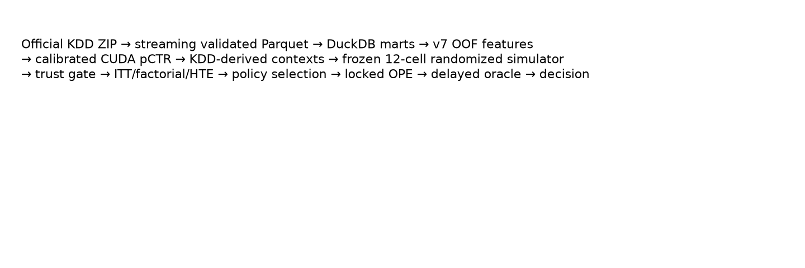
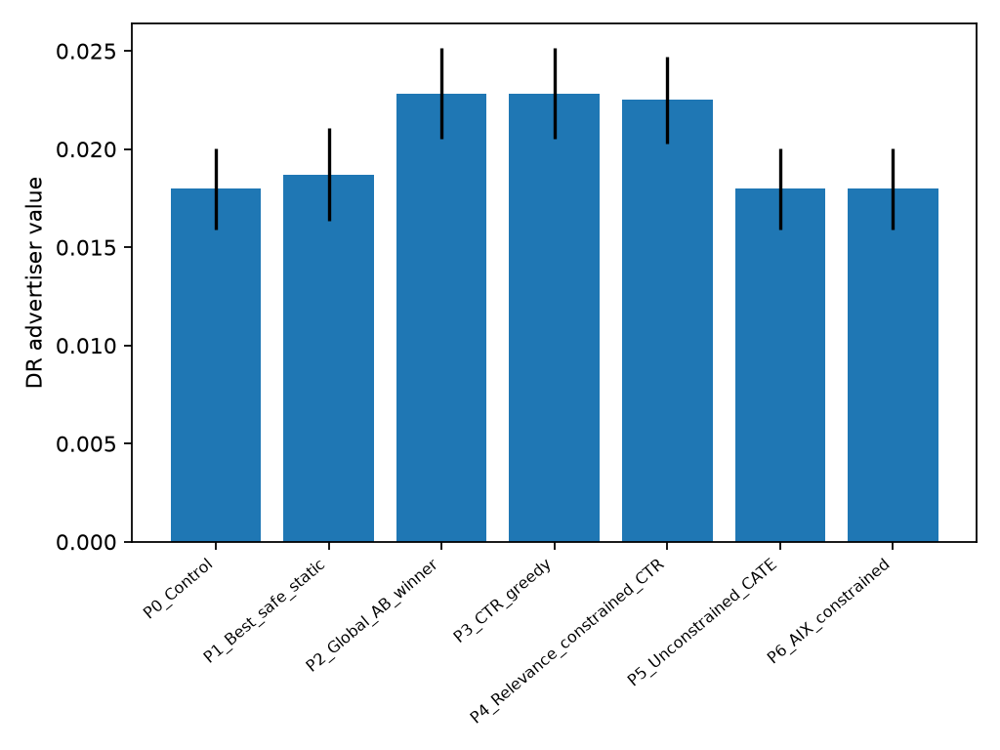
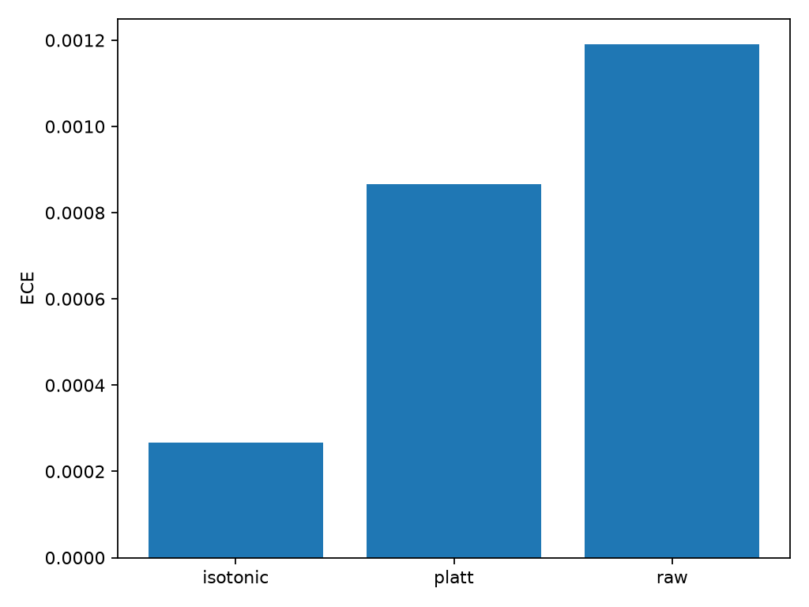
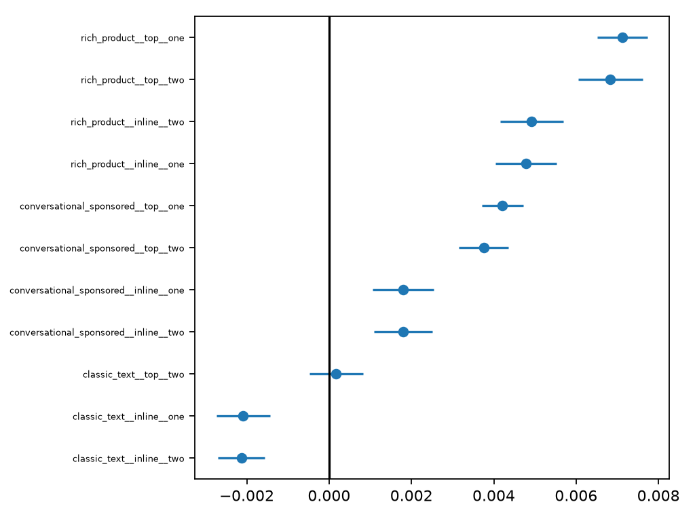
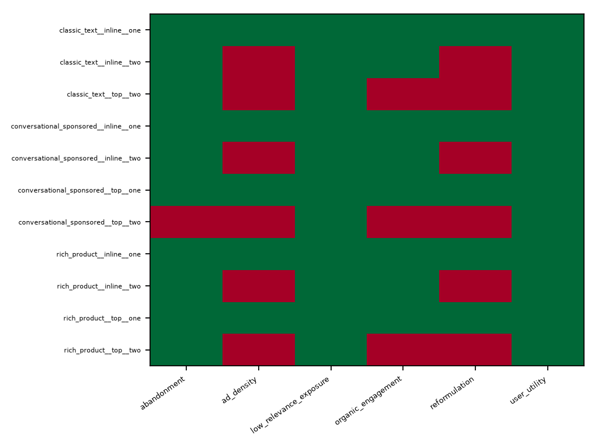
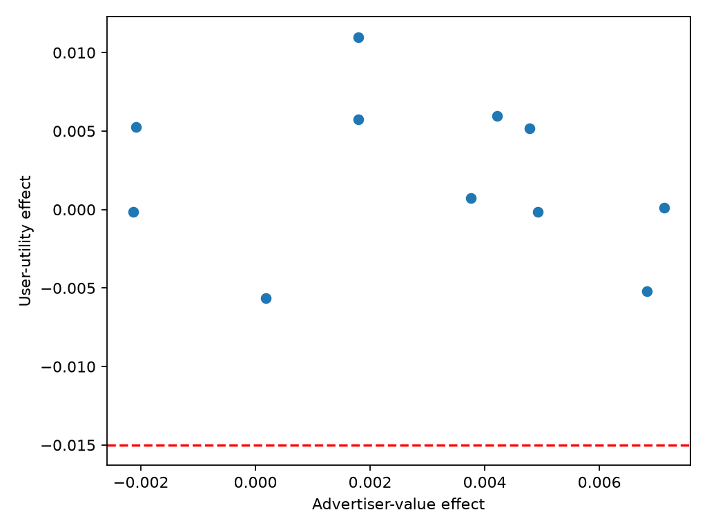

# AIX-Page

## Search Ads Experimentation, Causal Analysis & Safe Policy Evaluation

**A reproducible research benchmark combining 149.6M public sponsored-search records, GPU CTR modeling, a 17.0M-session controlled semi-synthetic whole-page experiment, and policy-level safety evaluation.**

[](https://github.com/ReviveCoding/aix-page/actions/workflows/ci.yml)
[](https://github.com/ReviveCoding/aix-page/releases)

| 149.6M | 235.6M | M2 | 0.1271 | 17.0M | **ITERATE** |
|---:|---:|:---:|---:|---:|:---:|
| public KDD rows | impressions | XGBoost CUDA winner | locked weighted log loss | controlled semi-synthetic sessions | final decision |

The central result is deliberately a negative policy result: the constrained contextual AIX policy was safe, but its locked doubly robust advertiser-value estimate was **3.93% below** the strongest safe static baseline. It was not promoted.



## Why this project

CTR alone is not a launch criterion. AIX-Page asks which search-ad page experiences improve advertiser value while satisfying hard user-utility, abandonment, relevance, density, worst-slice, integrity, and stability constraints. It combines real public sponsored-search data for predictive modeling with randomized, controlled semi-synthetic outcomes for causal product evaluation.

## Final decision: ITERATE

The frozen static finalist `rich_product__top__one` increased **simulated advertiser value** by 0.007125, or 40.90% relative to control (95% CI 0.006513 to 0.007738), while all frozen finalist guardrails passed. The effect was positive in all six pseudo-weeks. However, the frozen P6 contextual policy produced DR value 0.017976 versus 0.018710 for P1, the strongest safe baseline. The policy-learning claim failed its promotion gate, so the system recommends another policy-development cycle—not launch.



## Key evidence

- **Data:** 149,639,105 labeled KDD Cup 2012 Track 2 aggregate rows, 235,582,879 impressions, and 8,217,633 clicks; entity-grouped partitions had zero setting-group crossings.
- **Model:** M2 XGBoost CUDA won the frozen validation ladder at 0.133363 weighted log loss; one-time labeled locked test was 0.127129 with AUC 0.7794 and ECE 0.000787 after isotonic calibration.
- **Qualification:** 500 A/A replications gave 5.6% Type-I error and 94.4% interval coverage. Pilot variance powered 1,414,820 sessions per arm.
- **Trust:** stable user-level randomization passed SRM (p=0.9281), assignment, contamination, missingness, balance, and telemetry gates.
- **Inference:** ITT, 20-bucket user jackknife, CUPED, ANCOVA, user/query cluster bootstraps, Holm correction, factorial effects, pre-specified HTE, and six-period stability.
- **Policy:** known propensities supported IPS/SNIPS/DR evaluation on a one-time user-level policy holdout; safety was evaluated at the policy level.



## Architecture

Official archive → strict streaming validation → partitioned Parquet → DuckDB marts → entity-safe roles → cross-fitted historical features → GPU model ladder → calibration holdout → controlled semi-synthetic randomized experiment → causal inference → constrained policy OPE → delayed oracle audit → release decision.

See [Architecture](docs/ARCHITECTURE.md) and [Methodology](docs/METHODOLOGY.md).

## Modeling

KDD rows are aggregated binomial observations: clicks are successes and impressions are trials. Target-derived historical features are five-fold out-of-fold on training data; validation, calibration, locked test, experiment context, and challenge roles consume training history only. M0 prior, M1 hashed linear, M2 XGBoost CUDA, and M3 DCNv2 CUDA were compared under impression-weighted log loss. The simpler tree model beat the deep model and was retained.


## Experimentation and guardrails

The product experiment is **controlled semi-synthetic**—not production traffic. Persistent simulated users were assigned to 12 factorial format × position × density cells by stable SHA-256 hashing. The protocol identity existed before outcomes, and Tier-0 trust gates preceded effect analysis.





## Policy evaluation

Policy discovery, selection, and locked test used disjoint 60/20/20 user-level partitions. Hard constraints were not collapsed into a weighted score. P6 remained safe on locked evidence but underperformed P1. Preserving that negative result is the main demonstration of decision discipline.



## Reproduce

CPU smoke validation requires no KDD data:

```powershell
py -3.12 -m venv .venv
.\.venv\Scripts\python.exe -m pip install -e ".[dev]"
.\.venv\Scripts\python.exe -m pytest -q
```

Real-data and GPU reproduction require separately obtaining the official competition archive. See [Reproducibility](docs/REPRODUCIBILITY.md) and [Data access](docs/DATA_ACCESS.md).

## Evidence and governance

`public_evidence/` contains only compact CSV/JSON summaries with a source/public SHA-256 provenance manifest. Raw KDD data, row-level KDD derivatives, DuckDB databases, model binaries, and row-level experiment outcomes are not redistributed. Two invalid protocols and one pre-outcome abort are disclosed as compact governance records; none support claims.

## Claim boundary

This is an offline portfolio research benchmark using public KDD context and controlled semi-synthetic outcomes. It is not a Google Ads experiment, Google Search traffic, proprietary data, production advertiser lift, production revenue, or a deployed policy. Read the [full claim boundary](docs/CLAIM_BOUNDARY.md).

## Repository map

```text
src/aix_page/       research implementation
tests/              unit, integration, statistical, leakage, replay
sql/                DuckDB mart definitions
scripts/            public-safe ingestion/model reproduction entry points
configs/            sanitized frozen and development specifications
public_evidence/    compact locked summaries and provenance
reports/            recruiter and technical cards
docs/               access, methods, architecture, reproducibility, claims
```

## Limitations

KDD Track 2 is historical, hashed, aggregated sponsored-search data. Product outcomes are simulated under a frozen DGP rather than observed in a live product. The locked model test used a sampled labeled partition, and policy conclusions are specific to the controlled DGP and constraints. External validity requires a real, ethically governed product experiment.
